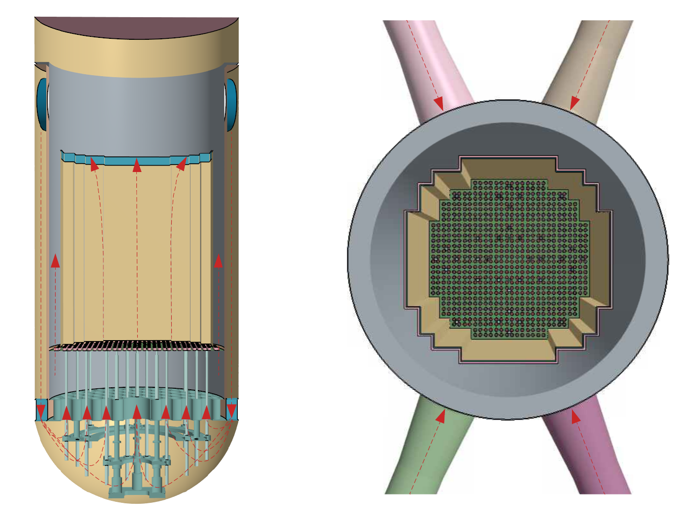
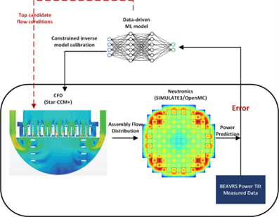

# Open Full-Scale PWR CAD, CFD Models, and Flow-Field Reconstruction Tools

This repository provides openly accessible computational resources for a full-scale four-loop pressurized water reactor (PWR), including **CAD geometry, high-fidelity computational fluid dynamics (CFD) model access, CFD postprocessing tools, and machine-learning workflows for reactor flow-field reconstruction**.

The open release is intended to lower the barrier to realistic nuclear thermal-hydraulics research and provide a common technical foundation that can be reused across institutions and national boundaries. By making reactor geometry, simulation models, supporting scripts, and analysis workflows openly available, this project aims to support **reproducible research, model benchmarking, education, data-driven method development, and national and international collaboration toward the safe and peaceful advancement of nuclear technology**.

The associated peer-reviewed publication is:

> **L. A. Burnett, H. Kim, H.-C. Chou, A. Witoelar, R. A. Brewster, B. Forget, E. Baglietto, and M. I. Radaideh,  
> “High-fidelity modeling of pressurized water reactor flow fields for data-driven applications,”  
> *Energy*, Vol. 362, 142104, 2026.**  
> https://doi.org/10.1016/j.energy.2026.142104

---

## Open PWR model and data release

### Quick access

| Resource | Description | Access |
|---|---|---|
| **PWR CAD geometry** | Reactor-vessel internal geometry and fuel-assembly block representations in STEP and Parasolid formats | [`CAD_and_CFD/`](CAD_and_CFD/) |
| **STAR-CCM+ CFD models** | High-fidelity PWR CFD simulation files distributed separately because of file size | **[Public CFD model download](INSERT_DROPBOX_LINK_HERE)** |
| **STAR-CCM+ automation** | Java macros and shell runners used for simulation automation and data collection | [`java_macros/`](java_macros/) |
| **CFD postprocessing** | CSV processing, HDF5 generation, mapping, visualization, video generation, and mesh/fidelity analysis | [`postprocessing/`](postprocessing/) |
| **Field-reconstruction ML** | CNN/3D-CNN training, evaluation, and reusable field-reconstruction modules | [`experiments/field_reconstruction/`](experiments/field_reconstruction/) |
| **Paper-to-code map** | Mapping between the associated publication and the code currently available in this repository | [`docs/paper-code-map.md`](docs/paper-code-map.md) |
| **Peer-reviewed publication** | *Energy* 362 (2026), 142104 | https://doi.org/10.1016/j.energy.2026.142104 |
| **Preprint** | Earlier manuscript version | https://arxiv.org/abs/2605.24763 |

### Reactor geometry and flow path

The PWR model represents a full-scale four-loop reactor vessel and core-inlet region. The geometry was constructed from publicly available reactor geometry and operating information to create a reusable computational representation suitable for high-fidelity thermal-hydraulics analysis.



The CAD release currently contains:

- `RV_solid.step` and `RV_solid.x_b` — solid reactor-vessel components excluding the fuel assemblies.
- `FAs.step` and `FAs.x_b` — block representations of the fuel assemblies, with one CAD body per fuel assembly, suitable for constructing porous-media representations of the core.
- STEP (`.step`) and Parasolid binary (`.x_b`) versions are provided to improve interoperability across CAD and simulation platforms.
- Detailed pin-resolved fuel-assembly CAD is **not currently included**.

Additional information is provided in [`CAD_and_CFD/README`](CAD_and_CFD/README).

### CFD model and sampled flow fields

The high-fidelity CFD simulations resolve the lower-plenum and core-inlet flow field of the PWR and were developed to study how pump-induced cold-leg flow structures propagate through the vessel and produce spatially heterogeneous assembly-level flow conditions.

For analysis and machine-learning applications, assembly-level flow quantities are sampled across multiple axial planes extending from the fuel-assembly inlet upward through the core.


Representative CFD results demonstrate the strong spatial structure of the lower-plenum and core-inlet flow fields, as well as the redistribution and mixing of coolant flow as it enters and travels through the core.


The native STAR-CCM+ simulation files are distributed through the external download linked above because they are too large for conventional Git hosting.

> **Software requirement:** The native `.sim` files require a compatible version of Siemens STAR-CCM+ to open and execute. The CAD files and many of the processed datasets and postprocessing tools can be used independently of STAR-CCM+.

---

## Why make these models open?

Detailed, simulation-ready models of commercial-scale nuclear reactor systems are difficult and time-consuming to construct. Although substantial information about PWR technology is publicly available, that information is distributed across benchmark specifications, regulatory documents, technical reports, and engineering references rather than assembled into a directly usable computational resource.

This project converts that dispersed public information into reusable CAD, CFD, and analysis resources. Making these models openly accessible allows other researchers to begin from a common computational reference rather than independently reconstructing the same reactor system.

Potential uses include:

- nuclear thermal-hydraulics research;
- CFD method and turbulence-model comparisons;
- model verification and cross-code benchmarking;
- reduced-order and surrogate modeling;
- machine learning and operator learning;
- sparse-sensor and field-reconstruction studies;
- digital-twin development;
- multiphysics coupling;
- uncertainty quantification;
- reactor safety and licensing research;
- graduate and undergraduate nuclear engineering education; and
- collaborative studies involving universities, national laboratories, industry, and international research institutions.

A central objective of this release is to make realistic reactor modeling resources easier to share across organizational and national boundaries. Common open reference models can improve reproducibility and make it easier for research groups to compare methods, validate new approaches, and build on one another's work. In this way, the project is intended to support broader collaboration in the safe and peaceful development and application of nuclear technology.

---

## Project and publication scope

This repository supports a broader NEUP project whose objective is to develop a
machine-learning-driven framework for inferring flow conditions and fuel bowing
from reactor detector measurements. The broader project combines CFD,
neutronics, detector data, and ML for reactor analysis and licensing research.

The **current publication reference is narrower than that project scope**. This
release contains the field-reconstruction ML workflow, reusable reconstruction
modules, CFD mass-flow postprocessing, supporting STAR-CCM+ automation, and
openly released PWR CAD geometry. The associated STAR-CCM+ simulation models
are provided through the external public download above because of their size.

See the **[paper-to-code map](docs/paper-code-map.md)** for the entry points,
inputs, outputs, and availability associated with each relevant section of
`paper/main.tex`.

The LSTM, ConvLSTM, DeepONet, and other one-step flow-prediction workflows
described in the paper are **not present in this repository release**. They are
planned for a later addition; the paper-to-code map records these gaps explicitly
and must be updated when those implementations are added.

### Repository component status

| Component | Status | Notes |
|---|---|---|
| **PWR CAD geometry** | **Openly available** | STEP and Parasolid files are included under [`CAD_and_CFD/`](CAD_and_CFD/). |
| **STAR-CCM+ CFD model and simulation setup** | **Openly available externally** | Native simulation files are distributed through the public external download because of their size. |
| STAR-CCM+ data-collection automation | Partial | Macros and shell runners are included in `java_macros/`, but remain dependent on STAR-CCM+ and the project simulation setup. |
| CFD mass-flow conversion and mesh-comparison analysis | Included | CSV combination, HDF5 conversion, plots, videos, and two-/three-fidelity error modes are in `postprocessing/`. |
| CNN/3D-CNN field reconstruction | Included | Experiment entry points and reusable modules are included. |
| LSTM one-step prediction | Planned | Code forthcoming—not present in this release. |
| ConvLSTM one-step prediction | Planned | Code forthcoming—not present in this release. |
| DeepONet one-step prediction | Planned | Code forthcoming—not present in this release. |
| Neutronics, detector-inference, and fuel-bowing workflows from the broader project | Planned or external | Not part of the current publication code reference. |

### CAD and CFD model availability

The CAD geometry is stored directly in this repository under
[`CAD_and_CFD/`](CAD_and_CFD/) in both STEP and Parasolid binary formats.

The native STAR-CCM+ CFD models are substantially larger and are therefore
distributed separately through the following public archive:

**[Download the STAR-CCM+ CFD models](INSERT_DROPBOX_LINK_HERE)**

Supporting scripts and STAR-CCM+ macros for inspecting, automating, and
postprocessing the associated workflow are included in this repository.

---

## Problem statement

- **Challenge:** Reactor models lack accurate as-built conditions, leading to **unexplained power tilts** in **pressurized water reactors (PWRs)** during low-power physics tests.
- **Hypothesis:** **Non-uniform inlet flow conditions** cause **fuel bowing**, altering neutron flux.
- **Current Limitation:** Simulation tools struggle to capture these effects accurately.

## Broader project approach

- **Use BEAVRS Benchmark:** Validate models using real-world **detector data from a PWR**.
- **ML & CFD Modeling:** Train **ML models** to correlate **detector signals** with **fuel bowing and inlet flow variations** using **CASMO/SIMULATE, OpenMC, and STAR-CCM+ CFD**.
- **Validation:** Compare model predictions with measured data to refine simulation accuracy.



## Broader project tasks

1. **Neutronic Modeling (MIT, UMich, NuScale):** Simulate **assembly gaps** and their impact on **detector signals**.
2. **CFD Modeling (MIT, UMich, NuScale):** Develop **high-fidelity CFD models** to analyze core **inlet flow distributions** and **flow anomalies**.
3. **ML Training (MIT, UMich, INL):** Use **CNNs & Bayesian ML** to infer flow conditions and fuel bowing from detector data.
4. **Verification & Validation (MIT, UMich, INL):** Validate ML predictions using **BEAVRS and NuScale SMR models**.
5. **Fuel Bowing Modeling (MIT, UMich):** Implement **3D bowed fuel models** in **OpenMC**.
6. **Scalability & Open-Source Tools (All Partners):** Publish framework for broader **reactor licensing applications**.

## Impact and relevance

- **Enhances SMR licensing** by improving reactor **safety and simulation accuracy**.
- **Reduces uncertainty in core flow conditions, fuel bowing, and power tilts**.
- **Improves prediction of key safety parameters** like **shutdown margin** and **critical heat flux**.
- **Generalizable ML framework** applicable to **BWRs, SMRs, and advanced reactors**.
- **Provides openly accessible reactor modeling resources** that can support reproducible thermal-hydraulics, machine-learning, and digital-twin research.
- **Enables researchers at different institutions to work from a common reference model**, facilitating comparison and benchmarking of computational methods.
- **Lowers barriers to national and international collaboration** by making realistic reactor geometry and simulation resources available without requiring each research group to reconstruct the model independently.

This broader project leverages ML and simulations to infer reactor conditions,
improving predictive modeling, safety, and licensing for SMRs and advanced
reactors. The component-status table above, rather than the broader project task
list, defines what is actually distributed in this repository release.

---

## Repository layout

The repository uses top-level folders for each workflow area:

```text
.
├── CAD_and_CFD/                    # Open PWR CAD geometry and model documentation
├── experiments/
│   ├── field_reconstruction/       # Runnable reconstruction experiments and tuning utilities
│   └── one_step_prediction/        # Model-specific locations for future one-step experiments
├── src/
│   └── neup_inference_of_flow/
│       └── field_reconstruction/   # Reusable data, model, training, metrics, and plotting modules
├── postprocessing/                 # CFD CSV conversion, HDF5 generation, and fidelity analysis
├── java_macros/                    # STAR-CCM+ Java macros and shell runners
├── tests/                          # Automated tests for reusable Python functionality
├── paper/
│   └── main.tex                    # LaTeX source used to define the paper/code correspondence
├── docs/
│   └── paper-code-map.md           # Paper sections, entry points, inputs, outputs, and availability
├── POD_tutorials/                  # POD/SPOD exploratory notebooks and helper code
├── figures/                        # Figure assets and generated visualizations
├── presentations/                  # Non-code project presentation material
└── refs/                           # Non-code reference documents
```

Install the reusable package from the repository root before running an
experiment or importing it in another project:

```bash
python -m pip install -e .
python -c "import neup_inference_of_flow.field_reconstruction"
```

Field-reconstruction publication and supplementary commands are documented in
[`experiments/field_reconstruction/README.md`](experiments/field_reconstruction/README.md).

The model-specific one-step-prediction directories are reserved for their
respective runnable configurations; those workflows are not included in this
release yet.

### `postprocessing/` structure

`postprocessing/` contains both the CLI pipeline and case-study data/results. Current contents include:

```text
postprocessing/
├── massflow_processing_pipeline.py
├── csvChecker.py
├── nonporous_core_gaps/
│   └── linear_k-eps/
│       ├── FApitch_over12/
│       └── fine_mesh_02112026/
├── porous_full_core/
│   ├── cubic_k-eps/
│   │   ├── FApitch_over12/
│   │   └── FApitch_over14/
│   └── linear_k-eps/
│       ├── FApitch_over10/
│       └── FApitch_over12/
└── outputs/
    └── analysis_*/
```

---

## Mass flow processing pipeline usage (`postprocessing/massflow_processing_pipeline.py`)

This script combines detector/batch CSVs, reorders data by layer/fuel assembly,
writes per-plane HDF5 files, generates mapping plots, and can also generate
videos and fidelity error plots.

### 1) Required input case layout (processing mode)

For processing mode, input must look like:

```text
<parent>/FApitch_overX/
└── raw_csv/
    ├── batch1.csv
    ├── batch2.csv
    ├── batch3.csv
    └── batch4.csv
```

- `X` must be an integer (e.g., `FApitch_over12`).
- `--batches-dir` must point to `raw_csv/`.
- The script enforces the `FApitch_overX` case-directory naming convention.

### 2) Typical processing command

From repository root:

```bash
python postprocessing/massflow_processing_pipeline.py \
  --batches-dir postprocessing/porous_full_core/linear_k-eps/FApitch_over12/raw_csv
```

Optional controls:

```bash
python postprocessing/massflow_processing_pipeline.py \
  --batches-dir postprocessing/porous_full_core/linear_k-eps/FApitch_over12/raw_csv \
  --pattern "batch*.csv" \
  --t-min 10 --t-max 20
```

### 3) Where outputs are saved

#### A) Processing mode (`--batches-dir .../FApitch_overX/raw_csv`)

Outputs are written to the case directory that contains `raw_csv/`:

```text
.../FApitch_overX/
├── intermediate/
│   ├── FApitch_overX_combined.csv
│   └── FApitch_overX_reordered.csv
├── hdf5/
│   └── plane_XX_<LayerTag>.h5
├── plots/
│   ├── mapping_avg_shared_colorbar_setYY.png
│   └── mapping_avg_per_layer_colorbars_setYY.png
└── video/                  # only when --video is enabled
    ├── video_*_shared.mp4
    └── video_*_per_subplot.mp4
```

#### B) Analysis from existing reordered CSV (`--use-reordered`)

- If the input path is `.../intermediate/*_reordered.csv`, outputs are saved under that case directory.
- Otherwise, outputs are written to a dated fallback folder: `outputs/analysis_<MMDDYYYY>/`.

#### C) Error analysis modes (`--error-2f` / `--error-3f`)

- Error plots are written under `<out_dir>/error_plots/`.
- By default, `out_dir` is inferred from input paths when possible; otherwise it falls back to `outputs/analysis_<MMDDYYYY>/`.

### 4) Video generation examples

Generate videos from an existing reordered CSV:

```bash
python postprocessing/massflow_processing_pipeline.py \
  --use-reordered postprocessing/porous_full_core/linear_k-eps/FApitch_over12/intermediate/FApitch_over12_reordered.csv \
  --video --video-fps 60 --video-every 20
```

Useful options:

- `--video-vmin`, `--video-vmax`
- `--video-max-frames`
- `--video-keep-frames`

### 5) 2-fidelity error analysis example

```bash
python postprocessing/massflow_processing_pipeline.py \
  --error-2f \
  --error-2f-comp-dir postprocessing/porous_full_core/linear_k-eps/FApitch_over12 \
  --error-2f-ref-dir  postprocessing/porous_full_core/linear_k-eps/FApitch_over10
```

### 6) 3-fidelity error analysis example

```bash
python postprocessing/massflow_processing_pipeline.py \
  --error-3f \
  --error-3f-case-a-dir postprocessing/porous_full_core/cubic_k-eps/FApitch_over12 \
  --error-3f-case-b-dir postprocessing/porous_full_core/linear_k-eps/FApitch_over10 \
  --error-3f-case-c-dir postprocessing/porous_full_core/linear_k-eps/FApitch_over12
```

Shared error options:

- `--core-mask-npy <path/to/mask.npy>`
- `--error-time-round <N>`
- `--error-asymmetric`

### 7) Quick troubleshooting

- Case directory must be named exactly `FApitch_overX`.
- Processing input must be `.../FApitch_overX/raw_csv`.
- Each error-analysis case must have `intermediate/*_reordered.csv` (or `reordered.csv`).
- For video mode, OpenCV (`cv2`) must be installed.

---

## Citation

If you use the PWR CAD geometry, CFD models, processed simulation data, or
associated workflows in academic work, please cite:

```bibtex
@article{burnett2026pwr,
  title   = {High-fidelity modeling of pressurized water reactor flow fields for data-driven applications},
  author  = {Burnett, Logan A. and Kim, Hyungjun and Chou, Hsien-Cheng and Witoelar, Arsha and Brewster, Robert A. and Forget, Benoit and Baglietto, Emilio and Radaideh, Majdi I.},
  journal = {Energy},
  volume  = {362},
  pages   = {142104},
  year    = {2026},
  doi     = {10.1016/j.energy.2026.142104}
}
```

When possible, please also reference this repository so that others can locate
the open computational resources used in the work.

---

## Licensing

Software distributed directly through this repository is provided under the
terms of the [`LICENSE`](LICENSE) file.

Users of the externally hosted CFD model files should also review any licensing
information included with the public model archive.

---

## Acknowledgments

This repository supports research conducted as part of a broader Nuclear Energy
University Program (NEUP) effort involving researchers from MIT, the University
of Michigan, NuScale, and Idaho National Laboratory.

The open release of the PWR geometry, CFD models, and associated tools is
intended to make these resources reusable beyond the original project and to
enable further research, benchmarking, education, and collaboration throughout
the nuclear engineering community.
